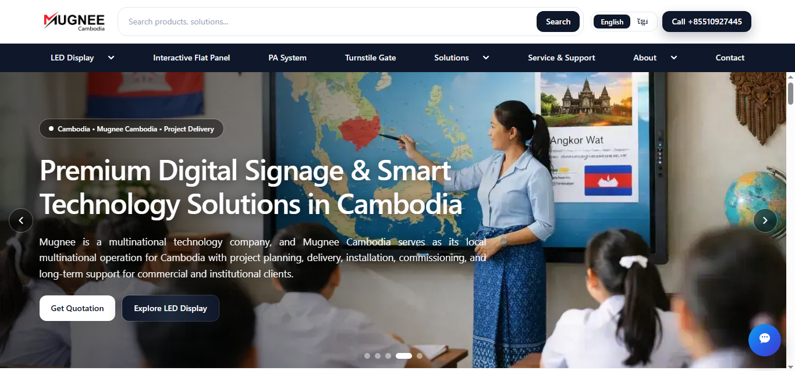
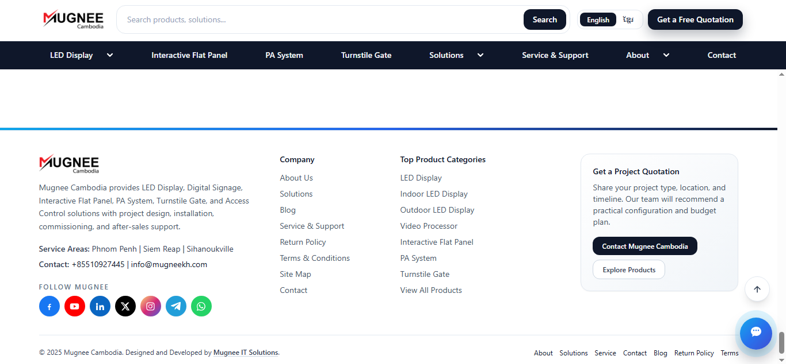
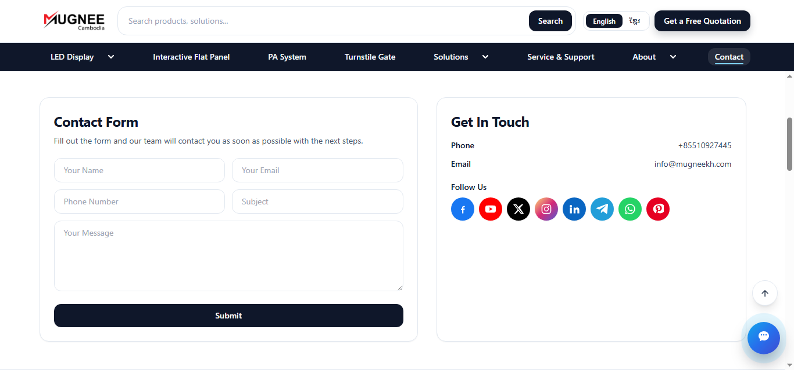
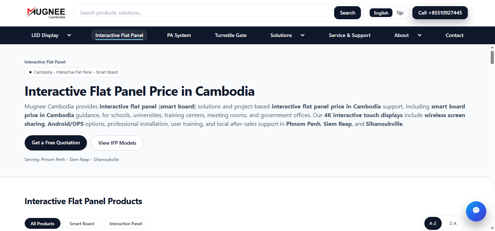
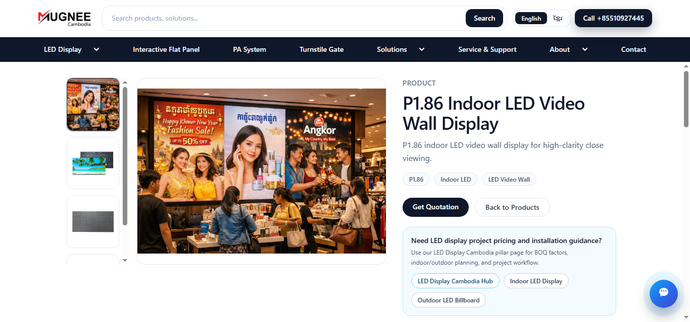
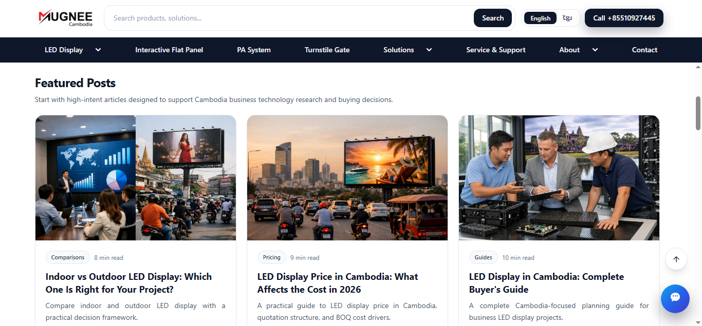

 

<!-- Primary CTAs -->

  
  &nbsp;&nbsp;
  

<!-- Context strip -->

  
  &nbsp;
  
  &nbsp;
  

<strong>PORTFOLIO SHOWCASE</strong> · Enterprise web platform · Cambodia &amp; regional buyers

  

# When your catalog is complex, your website should still feel effortless.

### Mugnee Cambodia — Corporate Web Platform

  <em>A premium, bilingual digital flagship for AV, LED, smart collaboration, and integrated security—engineered to earn trust before the first call.</em>

  <strong>Explore this README</strong> 
  <a href="#visual-tour">Visual tour</a>
  &nbsp;·&nbsp;
  <a href="#who-this-is-for">Who this is for</a>
  &nbsp;·&nbsp;
  <a href="https://mugneekh.com/">Live website</a>
  &nbsp;·&nbsp;
  <a href="https://mugneeit.com">Mugnee IT Solution</a>

 

---

  

<strong>First impression that holds.</strong> Clear positioning, confident storytelling, and obvious next steps—quotation, exploration, and human contact.

---

## At a glance

| | |
|:---|:---|
| **The opportunity** | Buyers research deeply before they ever email. Your site must explain depth *and* reduce risk—fast. |
| **What this delivers** | A **polished, enterprise-grade web experience** in **English and Khmer**, structured for products, solutions, education, and lead capture. |
| **See it live** | The production experience is public at **[mugneekh.com](https://mugneekh.com/)** — digital signage, smart boards, LED, PA, turnstiles, and project support for Cambodia. |
| **What you should feel** | **Premium.** Organized. Credible. The digital equivalent of a well-run showroom—not a cluttered PDF pasted online. |

---

## Why this matters for owners and commercial leaders

> **Revenue follows clarity.** When technical catalogs are presented with calm structure, strong narrative, and obvious “next steps,” more of the right conversations start—and they start sooner.

- **Protect margin, not just traffic.** High-intent visitors stay longer when they can self-educate without confusion, then raise their hand when they are ready.
- **Speak to Cambodia—and to partners abroad.** Bilingual presentation signals seriousness in-market while staying accessible to regional and international stakeholders.
- **Make quotation the natural outcome.** CTAs, forms, and contact paths are designed for commercial follow-up, not anonymous clicks.
- **Look as capable as your delivery.** For AV, LED, and security categories, *perception is part of the product.* The experience reinforces expertise and execution.

---

## What customers experience on the platform

| Capability | Business outcome |
|------------|------------------|
| **Category & solution hubs** | Visitors find the right “front door” for their need—without hunting through noise. |
| **Rich product storytelling** | Galleries, context, and guided links help buyers validate fit before your team invests time. |
| **Editorial & resources** | Thoughtful articles support serious research, SEO visibility, and trust during long sales cycles. |
| **Search & navigation** | Faster discovery across a wide catalog—especially when offerings span multiple product families. |
| **Trust & continuity** | Consistent branding from header to footer: service areas, categories, policies, and social proof where it belongs. |
| **Performance & polish** | Fast, modern pages that feel intentional on desktop and mobile—because first impressions are often on a phone. |

  

<strong>Continuity builds trust.</strong> Navigation, search, language choice, and footer systems work together so the brand feels deliberate end-to-end.

---

## Who this is for

**Ideal organizations**

- Distributors, integrators, and solution providers presenting **multi-category** line cards online.
- Teams selling **high-consideration** technology where buyers compare vendors for weeks—not minutes.
- Brands scaling in **Cambodia and Southeast Asia** that need **localized credibility** without diluting global standards.

**Typical outcomes you are planning for**

- More qualified inquiries and fewer “random” tickets.
- A website that sales and marketing can **point to with confidence** in meetings and proposals.
- A foundation that can grow as categories, campaigns, and content mature.

---

## The buyer journey (simple, deliberate)

1. **Arrive** — They understand *who you are* and *what you solve* in seconds—not paragraphs.
2. **Explore** — They move from interest to the right category, solution, or product family—without friction.
3. **Validate** — Proof, structure, and content reduce perceived risk *before* a conversation.
4. **Decide** — Comparison and detail feel organized—not overwhelming.
5. **Connect** — Inquiry is easy, respectful of their time, and ready for your team to respond professionally.
6. **Handoff** — Your commercial team receives interest with enough context to respond with speed and precision.

  

<strong>Conversion, thoughtfully designed.</strong> A contact experience that matches the quality of the rest of the site—and supports real follow-up.

---

## Engineering credibility (without the noise)

This platform is built on a modern, production-grade foundation focused on **speed**, **maintainability**, and **long-term marketing agility**:

**Next.js · React · TypeScript · Tailwind CSS** — plus disciplined build and delivery practices aligned with SEO performance and operational reliability.

<strong>For non-technical stakeholders: what this means in practice</strong>

- **Stable, fast experiences** that feel responsive in real-world networks.
- **A system that can evolve** as your catalog, campaigns, and content programs grow.
- **A serious engineering baseline** that matches the seriousness of the categories you sell.

---

## Visual tour

*A short walkthrough in the order buyers typically move: education → evaluation → contact.*

### Category hub — clarity at the “front door”

  

Example hub layout: filters, sorting, and obvious paths to models and quotation.

### Product detail — confidence in the specifics

  

Product storytelling with gallery context and a clean path to commercial next steps.

### Resources — authority that supports the sale

  

Editorial modules that help buyers research deeply—then reach out with better questions.

### Screenshot index

| File | What it highlights |
|------|----------------------|
| `screenshots/01-homepage-hero.png` | Flagship first impression and primary story |
| `screenshots/02-interactive-flat-panel-hub.png` | Category hub, discovery, lead actions |
| `screenshots/03-product-detail-led.png` | Product detail depth and quotation readiness |
| `screenshots/04-featured-posts-resources.png` | Trust-building resources and research support |
| `screenshots/05-contact-lead-capture.png` | Inquiry flow and contact channels |
| `screenshots/06-header-footer-trust.png` | Navigation + footer systems that reinforce credibility |

---

## Architecture (high level)

| Layer | Role |
|-------|------|
| **Experience** | Consistent layouts, premium presentation, and repeatable page patterns. |
| **Content** | Organized products, solutions, and editorial surfaces that marketing can evolve over time. |
| **Delivery** | Production-ready output suitable for secure, scalable hosting and global performance. |

No proprietary implementation details, credentials, or confidential integration logic are included in this public showcase.

---

## Privacy of the full source code

The **complete source code**, internal repositories, and deployment configuration remain **private**—by design—to protect **client confidentiality**, **commercial interests**, and **operational security**.

If you are evaluating a similar initiative, Mugnee can provide a **controlled walkthrough**, **sanitized artifacts**, and a discussion under an appropriate **NDA**.

---

## Build a digital flagship—not just a website

**Mugnee Cambodia (live)** · [mugneekh.com](https://mugneekh.com/)  
**Mugnee IT Solution** · [mugneeit.com](https://mugneeit.com)

If you are planning a **new corporate platform**, a **bilingual regional launch**, or a **performance and visibility upgrade** for an existing site, start a conversation with Mugnee—or explore how this case study presents on **[mugneekh.com](https://mugneekh.com/)** today.

*We design and deliver digital experiences that are **clear for leadership**, **convincing for buyers**, and **sustainable for the teams who run them**.*

---

Portfolio repository: <code>mugnee-kh-public</code>

